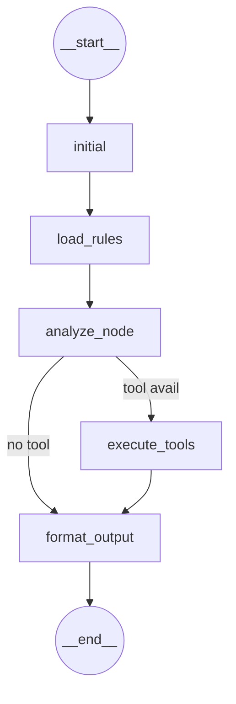

# AlcheCode

## License

This project is built upon [LangChain](https://github.com/langchain-ai/langchain)  
which is licensed under the [MIT License](https://github.com/langchain-ai/langchain/blob/master/LICENSE).
